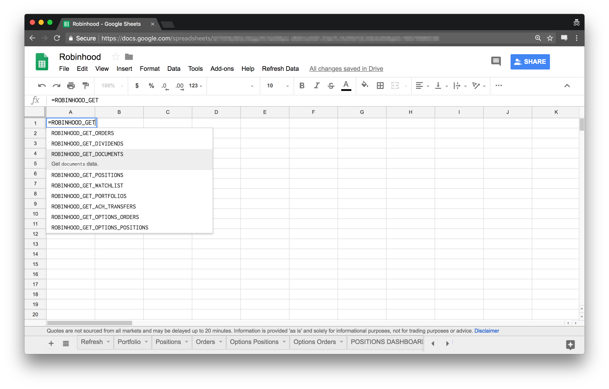
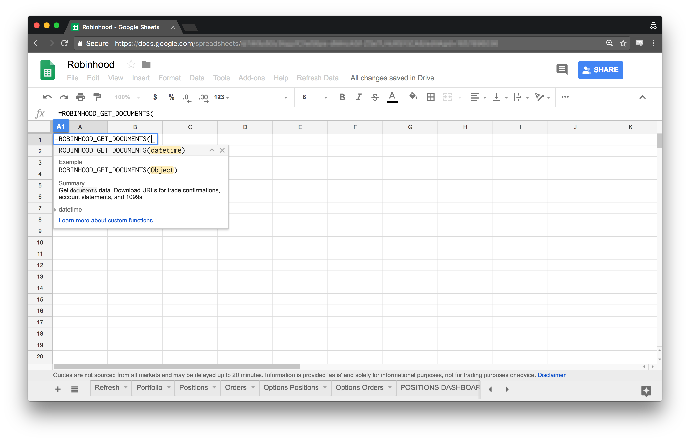
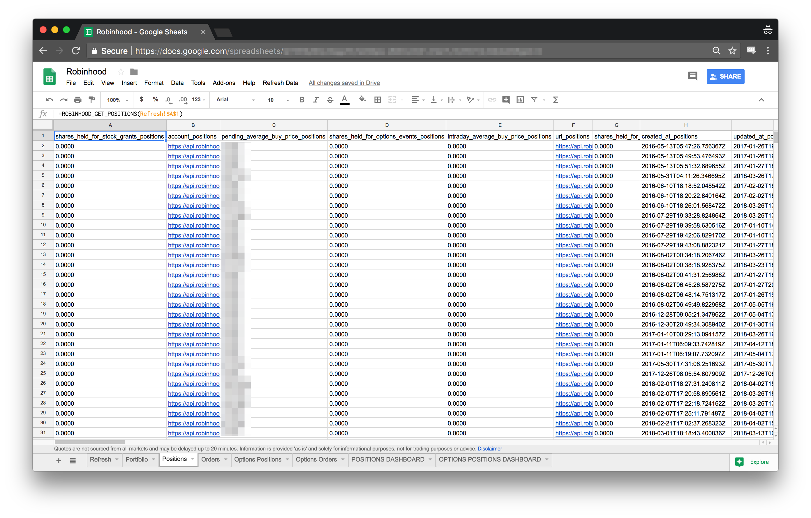
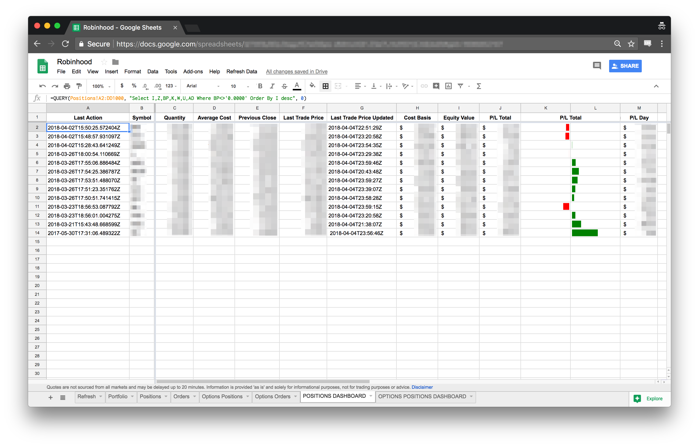
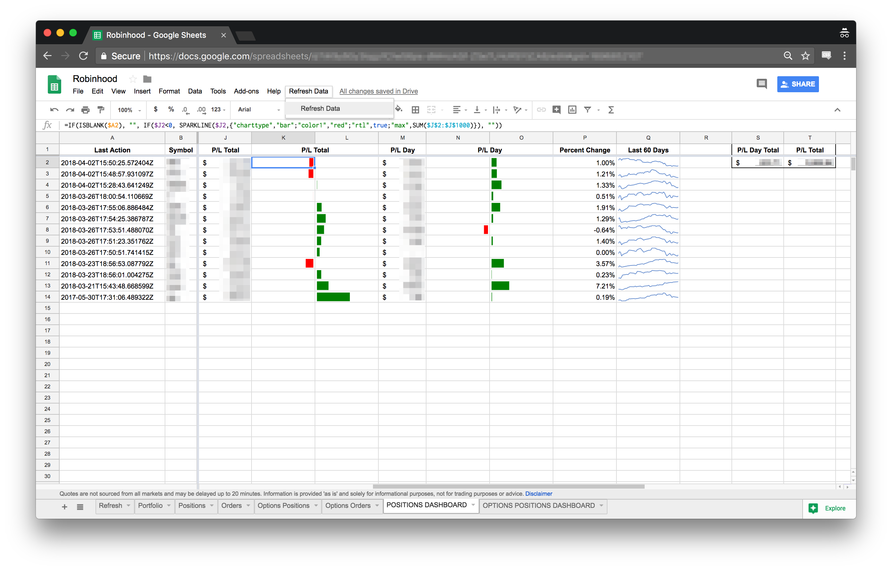

# Robinhood for Google Sheets

[Google Apps Script custom functions](https://developers.google.com/apps-script/guides/sheets/functions) that retrieve stock and options data from the Robinhood API and return data in a tabular format for use in Google Sheets.

The Robinhood API is not publicly available but has been [explored extensively](https://www.google.com/search?q=robinhood+api) and is  accessible after [authenticating](https://github.com/sanko/Robinhood/blob/master/Authentication.md).

## Script "installation"

1. [Create](https://docs.google.com/spreadsheets/create) or open a spreadsheet in Google Sheets.
2. Select the menu item **Tools > Script editor**. If you are presented with a welcome screen, click **Blank Project** on the left to start a new project.
3. Delete any code in the script editor.
4. Copy and paste all code in [`robinhood.gs`](robinhood.gs) into the script editor.
5. **IMPORTANT:** Replace [`robinhoodUsername` and `robinhoodPassword`](robinhood.gs#L8-L9) with your own Robinhood credentials. e.g.
```
var robinhoodUsername = 'janedoe';
var robinhoodPassword = 'passw0rd';
```
6. Select the menu item **File > Save**. Give the script project a name and click OK.
7. Refresh the spreadsheet. You will now be able to use custom functions to retrieve your Robinhood data!

## Custom functions

#### [`ROBINHOOD_GET_ACH_TRANSFERS()`](robinhood.gs#L223)
* Get `ACH transfers` data
* Columns returned:
  - `scheduled_achTransfers`, `direction_achTransfers`, `url_achTransfers`, `created_at_achTransfers`, `state_achTransfers`, `updated_at_achTransfers`, `amount_achTransfers`, `early_access_amount_achTransfers`, `fees_achTransfers`, `cancel_achTransfers`, `account_ach_relationship`, `verification_method_ach_relationship`, `verify_micro_deposits_ach_relationship`, `url_ach_relationship`, `bank_account_nickname_ach_relationship`, `created_at_ach_relationship`, `bank_account_holder_name_ach_relationship`, `bank_account_number_ach_relationship`, `bank_account_type_ach_relationship`, `unlinked_at_ach_relationship`, `initial_deposit_ach_relationship`, `withdrawal_limit_ach_relationship`, `verified_ach_relationship`, `unlink_ach_relationship`, `bank_routing_number_ach_relationship`, `id_ach_relationship`, `expected_landing_date_achTransfers`, `status_description_achTransfers`, `id_achTransfers`

#### [`ROBINHOOD_GET_DIVIDENDS()`](robinhood.gs#L231)
* Get `dividends` data
* Columns returned:
  - `account_dividends`, `url_dividends`, `amount_dividends`, `payable_date_dividends`, `min_tick_size_instrument`, `type_instrument`, `splits_instrument`, `margin_initial_ratio_instrument`, `url_instrument`, `quote_instrument`, `tradability_instrument`, `bloomberg_unique_instrument`, `list_date_instrument`, `name_instrument`, `symbol_instrument`, `fundamentals_instrument`, `state_instrument`, `country_instrument`, `day_trade_ratio_instrument`, `tradeable_instrument`, `maintenance_ratio_instrument`, `id_instrument`, `market_instrument`, `simple_name_instrument`, `rate_dividends`, `record_date_dividends`, `position_dividends`, `withholding_dividends`, `id_dividends`, `paid_at_dividends`

#### [`ROBINHOOD_GET_DOCUMENTS()`](robinhood.gs#L239)
* Get `documents` data. Download URLs for trade confirmations, account statements, and 1099s
* Columns returned:
  - `account_documents`, `url_documents`, `created_at_documents`, `updated_at_documents`, `download_url_documents`, `insert_3_url_documents`, `insert_4_url_documents`, `insert_1_url_documents`, `insert_6_url_documents`, `date_documents`, `insert_2_url_documents`, `insert_5_url_documents`, `type_documents`, `id_documents`

#### [`ROBINHOOD_GET_OPTIONS_ORDERS()`](robinhood.gs#L247)
* Get `options orders` data
* Columns returned:
  - `direction_optionsOrders`, `premium_optionsOrders`, `time_in_force_optionsOrders`, `processed_premium_optionsOrders`, `updated_at_optionsOrders`, `created_at_optionsOrders`, `pending_quantity_optionsOrders`, `ref_id_optionsOrders`, `state_optionsOrders`, `processed_quantity_optionsOrders`, `id_optionsOrders`, `price_optionsOrders`, `cancel_url_optionsOrders`, `trigger_optionsOrders`, `chain_id_optionsOrders`, `response_category_optionsOrders`, `chain_symbol_optionsOrders`, `adjusted_mark_price_marketData`, `ask_price_marketData`, `ask_size_marketData`, `bid_price_marketData`, `bid_size_marketData`, `break_even_price_marketData`, `high_price_marketData`, `instrument_marketData`, `last_trade_price_marketData`, `last_trade_size_marketData`, `low_price_marketData`, `mark_price_marketData`, `open_interest_marketData`, `previous_close_date_marketData`, `previous_close_price_marketData`, `volume_marketData`, `chance_of_profit_long_marketData`, `chance_of_profit_short_marketData`, `delta_marketData`, `gamma_marketData`, `implied_volatility_marketData`, `rho_marketData`, `theta_marketData`, `vega_marketData`, `tradability_option`, `strike_price_option`, `url_option`, `expiration_date_option`, `created_at_option`, `chain_id_option`, `updated_at_option`, `state_option`, `type_option`, `chain_symbol_option`, `cutoff_price_option`, `below_tick_option`, `above_tick_option`, `id_option`, `side_marketData`, `position_effect_marketData`, `id_marketData`, `executions_marketData`, `ratio_quantity_marketData`, `type_optionsOrders`, `canceled_quantity_optionsOrders`, `quantity_optionsOrders`

#### [`ROBINHOOD_GET_OPTIONS_POSITIONS()`](robinhood.gs#L255)
* Get current and past `options positions` data
* Columns returned:
  - `intraday_average_open_price_optionsPositions`, `account_optionsPositions`, `intraday_quantity_optionsPositions`, `adjusted_mark_price_marketData`, `ask_price_marketData`, `ask_size_marketData`, `bid_price_marketData`, `bid_size_marketData`, `break_even_price_marketData`, `high_price_marketData`, `instrument_marketData`, `last_trade_price_marketData`, `last_trade_size_marketData`, `low_price_marketData`, `mark_price_marketData`, `open_interest_marketData`, `previous_close_date_marketData`, `previous_close_price_marketData`, `volume_marketData`, `chance_of_profit_long_marketData`, `chance_of_profit_short_marketData`, `delta_marketData`, `gamma_marketData`, `implied_volatility_marketData`, `rho_marketData`, `theta_marketData`, `vega_marketData`, `tradability_option`, `strike_price_option`, `url_option`, `expiration_date_option`, `created_at_option`, `chain_id_option`, `updated_at_option`, `state_option`, `type_option`, `chain_symbol_option`, `cutoff_price_option`, `below_tick_option`, `above_tick_option`, `id_option`, `created_at_marketData`, `updated_at_marketData`, `average_price_marketData`, `chain_id_marketData`, `pending_expired_quantity_marketData`, `pending_buy_quantity_marketData`, `url_marketData`, `pending_sell_quantity_marketData`, `chain_symbol_marketData`, `type_marketData`, `id_marketData`, `quantity_marketData`

#### [`ROBINHOOD_GET_ORDERS()`](robinhood.gs#L263)
* Get `stock orders` data
* Columns returned:
  - `updated_at_orders`, `ref_id_orders`, `time_in_force_orders`, `fees_orders`, `cancel_orders`, `response_category_orders`, `id_orders`, `cumulative_quantity_orders`, `stop_price_orders`, `reject_reason_orders`, `min_tick_size_instrument`, `type_instrument`, `splits_instrument`, `margin_initial_ratio_instrument`, `url_instrument`, `quote_instrument`, `tradability_instrument`, `bloomberg_unique_instrument`, `list_date_instrument`, `name_instrument`, `symbol_instrument`, `fundamentals_instrument`, `state_instrument`, `country_instrument`, `day_trade_ratio_instrument`, `tradeable_instrument`, `maintenance_ratio_instrument`, `id_instrument`, `market_instrument`, `simple_name_instrument`, `state_orders`, `trigger_orders`, `override_dtbp_checks_orders`, `type_orders`, `last_transaction_at_orders`, `price_orders`, `executions_orders`, `extended_hours_orders`, `account_orders`, `url_orders`, `created_at_orders`, `side_orders`, `override_day_trade_checks_orders`, `shares_held_for_stock_grants_position`, `account_position`, `pending_average_buy_price_position`, `shares_held_for_options_events_position`, `intraday_average_buy_price_position`, `url_position`, `shares_held_for_options_collateral_position`, `created_at_position`, `updated_at_position`, `shares_held_for_buys_position`, `average_buy_price_position`, `instrument_position`, `intraday_quantity_position`, `shares_held_for_sells_position`, `shares_pending_from_options_events_position`, `quantity_position`, `average_price_orders`, `quantity_orders`

#### [`ROBINHOOD_GET_PORTFOLIOS()`](robinhood.gs#L271)
* Get `portfolios` data. Only one portfolio is returned (for now?)
* Columns returned:
  - `unwithdrawable_grants_portfolios`, `account_portfolios`, `excess_maintenance_with_uncleared_deposits_portfolios`, `url_portfolios`, `excess_maintenance_portfolios`, `market_value_portfolios`, `withdrawable_amount_portfolios`, `last_core_market_value_portfolios`, `unwithdrawable_deposits_portfolios`, `extended_hours_equity_portfolios`, `excess_margin_portfolios`, `excess_margin_with_uncleared_deposits_portfolios`, `equity_portfolios`, `last_core_equity_portfolios`, `adjusted_equity_previous_close_portfolios`, `equity_previous_close_portfolios`, `start_date_portfolios`, `extended_hours_market_value_portfolios`

#### [`ROBINHOOD_GET_POSITIONS()`](robinhood.gs#L279)
* Get current and past `stocks positions` data
* Columns returned:
  - `shares_held_for_stock_grants_positions`, `account_positions`, `pending_average_buy_price_positions`, `shares_held_for_options_events_positions`, `intraday_average_buy_price_positions`, `url_positions`, `shares_held_for_options_collateral_positions`, `created_at_positions`, `updated_at_positions`, `shares_held_for_buys_positions`, `average_buy_price_positions`, `min_tick_size_instrument`, `type_instrument`, `splits_instrument`, `margin_initial_ratio_instrument`, `url_instrument`, `ask_price_quote`, `ask_size_quote`, `bid_price_quote`, `bid_size_quote`, `last_trade_price_quote`, `last_extended_hours_trade_price_quote`, `previous_close_quote`, `adjusted_previous_close_quote`, `previous_close_date_quote`, `symbol_quote`, `trading_halted_quote`, `has_traded_quote`, `last_trade_price_source_quote`, `updated_at_quote`, `instrument_quote`, `tradability_instrument`, `bloomberg_unique_instrument`, `list_date_instrument`, `name_instrument`, `symbol_instrument`, `open_fundamentals`, `high_fundamentals`, `low_fundamentals`, `volume_fundamentals`, `average_volume_2_weeks_fundamentals`, `average_volume_fundamentals`, `high_52_weeks_fundamentals`, `dividend_yield_fundamentals`, `low_52_weeks_fundamentals`, `market_cap_fundamentals`, `pe_ratio_fundamentals`, `shares_outstanding_fundamentals`, `description_fundamentals`, `instrument_fundamentals`, `ceo_fundamentals`, `headquarters_city_fundamentals`, `headquarters_state_fundamentals`, `sector_fundamentals`, `num_employees_fundamentals`, `year_founded_fundamentals`, `state_instrument`, `country_instrument`, `day_trade_ratio_instrument`, `tradeable_instrument`, `maintenance_ratio_instrument`, `id_instrument`, `market_instrument`, `simple_name_instrument`, `intraday_quantity_positions`, `shares_held_for_sells_positions`, `shares_pending_from_options_events_positions`, `quantity_positions`

#### [`ROBINHOOD_GET_WATCHLIST()`](robinhood.gs#L287)
* Get `watchlist` data
* Columns returned:
  - `watchlist_watchlist`, `min_tick_size_instrument`, `type_instrument`, `splits_instrument`, `margin_initial_ratio_instrument`, `url_instrument`, `ask_price_quote`, `ask_size_quote`, `bid_price_quote`, `bid_size_quote`, `last_trade_price_quote`, `last_extended_hours_trade_price_quote`, `previous_close_quote`, `adjusted_previous_close_quote`, `previous_close_date_quote`, `symbol_quote`, `trading_halted_quote`, `has_traded_quote`, `last_trade_price_source_quote`, `updated_at_quote`, `instrument_quote`, `tradability_instrument`, `bloomberg_unique_instrument`, `list_date_instrument`, `name_instrument`, `symbol_instrument`, `open_fundamentals`, `high_fundamentals`, `low_fundamentals`, `volume_fundamentals`, `average_volume_2_weeks_fundamentals`, `average_volume_fundamentals`, `high_52_weeks_fundamentals`, `dividend_yield_fundamentals`, `low_52_weeks_fundamentals`, `market_cap_fundamentals`, `pe_ratio_fundamentals`, `shares_outstanding_fundamentals`, `description_fundamentals`, `instrument_fundamentals`, `ceo_fundamentals`, `headquarters_city_fundamentals`, `headquarters_state_fundamentals`, `sector_fundamentals`, `num_employees_fundamentals`, `year_founded_fundamentals`, `state_instrument`, `country_instrument`, `day_trade_ratio_instrument`, `tradeable_instrument`, `maintenance_ratio_instrument`, `id_instrument`, `market_instrument`, `simple_name_instrument`, `created_at_watchlist`, `url_watchlist`

> **NOTE:** Columns returned will change if Robinhood API responses change

## `Refresh Data` menu item

TL;DR: Calling a `ROBINHOOD_GET` function _without_ changing the argument passed to function will _not_ return new data. A `Refresh Data` custom menu item is implemented so that data can be refreshed.

Apps Script custom functions are deterministic and will only recalculate if their arguments change. All `ROBINHOOD_GET` functions have an optional `datetime` parameter so that the current datetime can be passed to the function in order to force recalculation. A [Google Sheets custom menu](https://developers.google.com/apps-script/guides/menus#custom_menus_in_google_docs_sheets_or_forms) with a `Refresh Data` item is implemented so that a current datetime value can be set in cell `Refresh!$A$1`. `ROBINHOOD_GET` functions that reference this cell will return non-cached, fresh results when `Refresh Data` is clicked. Stolen from https://stackoverflow.com/a/17347290. Example:

```
ROBINHOOD_GET_POSITIONS(Refresh!$A$1)
```

## Examples of usage in Google Sheets






> **NOTE:** These are examples of a dashboard created *using* data returned by the functions. Data can be consumed in whatever way you see fit!




## Gotchas

* Script does not support accounts set up with two-factor authentication.
* Code may break unexpectedly as it depends on Robinhood's private API!
* Some API fields are not returned in full. e.g. the `/options/orders/` endpoint returns a `legs` field that might (I have yet to test) contain multiple components and executions if an options strategy contains multiple contracts. The code in its current state does not expand these results. Example response:

```json
{
  "direction": "credit",
  "premium": "5.00000000",
  "time_in_force": "gfd",
  "processed_premium": "10.00000000000000000",
  "updated_at": "2018-04-18T17:11:38.981149Z",
  "created_at": "2018-04-18T17:11:38.315155Z",
  "pending_quantity": "0.00000",
  "ref_id": "CCBCE885-E41D-42A1-9EAE",
  "state": "filled",
  "processed_quantity": "2.00000",
  "id": "6822d0a2-737d-48de-8a24",
  "price": "0.05000000",
  "cancel_url": null,
  "trigger": "immediate",
  "chain_id": "57661a97-f7d4-470c-80c5",
  "response_category": "success",
  "chain_symbol": "ROB.N",
  "legs": [
    {
      "option": "https://api.robinhood.com/options/instruments/06717265-09c1-4e20-8f60/",
      "side": "sell",
      "position_effect": "open",
      "id": "66054ae1-5f30-4725-b203",
      "executions": [
        {
          "timestamp": "2018-04-18T17:11:38.581000Z",
          "price": "0.05000000",
          "settlement_date": "2018-04-19",
          "id": "8a49f0e9-52c9-4db3-ae2d",
          "quantity": "2.00000"
        }
      ],
      "ratio_quantity": 1
    }
  ],
  "type": "limit",
  "canceled_quantity": "0.00000",
  "quantity": "2.00000"
}
```

* A custom function call must return within 30 seconds. If it does not, the cell will display an error: `Internal error executing the custom function.`

**I have only been able to test this code with my own account; any PRs or issues created are welcome! 😎📈**
